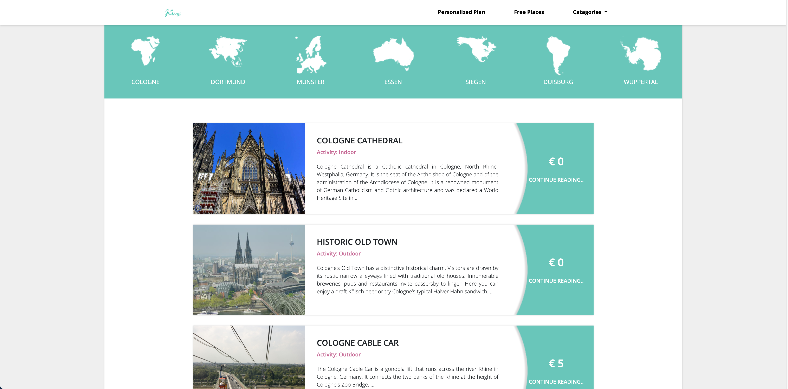
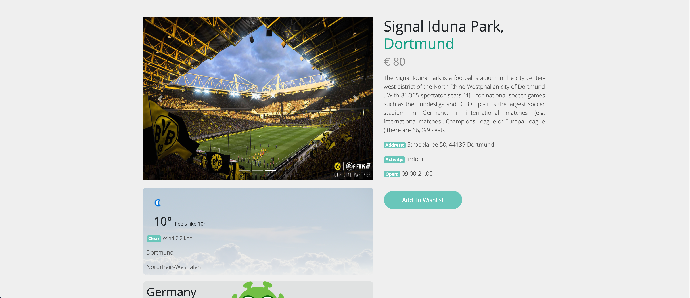
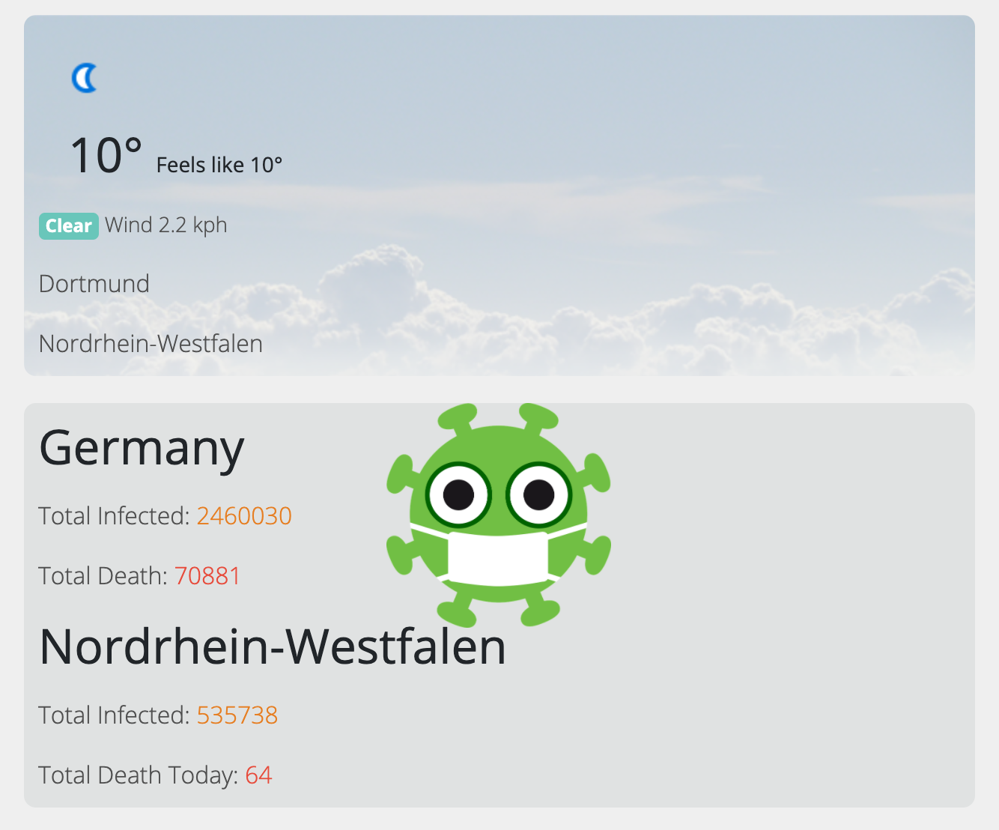

# Journey a travel information app

In this app we basically worked with NRW travel data. Traveller can easily search places by city. There are also places by different categories.

The app is build with these following technologies:
* [NodeJS](https://nodejs.org)
* [ExpressJS](https://expressjs.com/)
* [MongoDB](https://www.mongodb.com/)
* [Mongoose](https://mongoosejs.com/)
* [Body-Parser](https://www.npmjs.com/package/body-parser)
* [EJs](https://ejs.co/)

## Home Page


## Top Places in NRW


## Top Places by City


## Place Details Page


We also worked with the live weather data as well live corona update of the corresponding place
## Live Weather and Corona Update


## Installation and Configuration
Please make sure you have these following software installed in your system:
* Node.js
* NPM
* Git

Just clone the repository:
```
$ git clone https://github.com/aumtuhin/Journey.git
```

CD to the cloned directory then we have to install the necessary dependencies using either NPM or Yarn:
```
$ npm i
```
```
$ node app.js
```
Or you can use nodemon to automatically restarting the node application when file changes in the directory are detected.

```
$ npm install -g nodemon
```

Then 

```
nodemon
```


As we are using mongoDB database you can either use mongoDB from your local computer or you can use mongoDB database from mongoDB official site

* Go to the [MongoDB](https://www.mongodb.com/) website
* Create an account for free or sign in
* Create a new project and cluster
* Click on connection and copy the connection string
* Go to the db.js file from Config folder and pase it as below: 

```
module.exports = {
    dbcon: 'your connection string'
}
```
* Save the file and run 

```
nodemon/ node app.js
```
Now visit 

```
localhost:8080
```

## License
[MIT License](https://github.com/aumtuhin/Journey/blob/master/LICENSE).

## Conclusion
Star, Fork, Pull request and contribution will be much appreciated. You can contribute to this project as your own as it has lot to develop.
